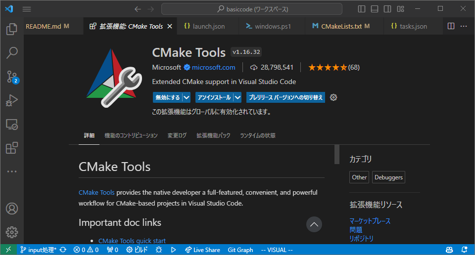
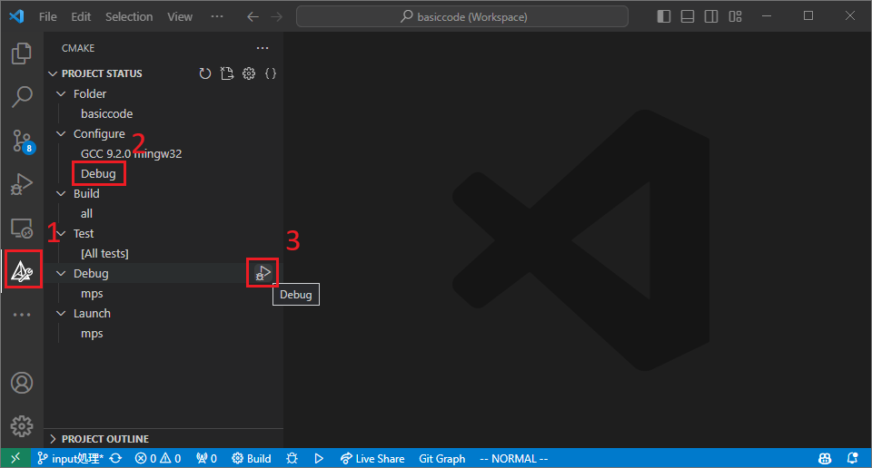

# BasicCode

Modernized Moving Particle Semi-implicit/Simulation method code written in C++.

## Requirements
### Executing
- Git
- cmake (newer than 3.9)
- C++ 17 compiler
- OpenMP 5.0 and above (optional)

### Development
- Doxygen and Graphviz (optional, for building documents)

## Execution in Command Line
- It's easier to do it in Visual Studio Code as shown later, but it's better to do it in command line for your understanding.

### Build
```bash
cmake -S . -B build # Generate build system
# -S: Source tree. The location of CMakeLists.txt
# -B: Build tree. Directory for storing products for builds
cmake --build build # Execute build
```
- You don't have to make `build` directory (`mkdir build`) and move to the directory (`cd build`), thanks to the `-B build` option. The `build` directory will be automatically generated if you don't have one.

### Execution
#### Windows
```powershell
./build/mps.exe 2>result/error.log # run simulation
```

#### Linux
```bash
./build/mps 2>result/error.log # run simulation
```

## Execution in Visual Studio Code
- Install CMake Tools.

	

### Build
1. Open Cmake tab.
2. Change `Configure` to `Release`
3. Execute `Build`

	

### Execution
- Execute in the same way as the command line.
- Script files are prepared in the `scripts` folder. You can just call it.
- Don't use the `Launch` button on the CMake tab. It will launch the program in a wrong directory, and it won't delete existing files.

#### Windows
```powershell
./scripts/windows.ps1
```

#### Linux
```sh
./scripts/linux.sh
```

#### Note
- You can configure `tasks` to do it easily.

1. Create `.vscode/tasks.json` file.

	

1. An example for Windows:
	```json
	{
		"tasks": [
    	{
      	"label": "Execute",
      	"type": "shell",
      	"command": "./scripts/windows.ps1",
      	"options": {
        	"cwd": "${workspaceFolder}"
      	},
      	"group": {
        	"kind": "test",
        	"isDefault": true
      	}
    	},
  	],
  	"version": "2.0.0"
	}
	```

1. Open Command Palette (`Ctrl + Shift + P` or `F1`). Search and execute `Tasks: Run Test Task`. It does the same thing as calling the script in the terminal.

	

- You can set a keyboard showtcut to run test task. To do so, open Command Palette and move on to `Preferences: Keyboard Shortcuts`. Search `Tasks: Run Test Task` and set any keybinding you want. `Ctrl + Shift + T` is a suggestion of the writer.

	

## I/O
### Input
To be written.

### Output
- The results are written in the following formats:
	- `result/prof`: Profile data
	- `result/vtu`: VTK data

#### Profile data
- The profile data is in the following format:

```prof
0  // time
627  // number of particles
3 -0.1 -0.1 0 0 0 0  // type x y z u v w
3 -0.1 -0.075 0 0 0 0
3 -0.1 -0.05 0 0 0 0
...
```


## Debugging in Visual Studio Code
1. Open Cmake tab.
2. Change `Configure` to `Debug`
3. Execute `Debug`

	

- Unlike the `launch` button in the previous section, the `debug` button will execute the code in the correct directory. Also, there is no need to delete existing files when debugging. So you can just press it this time.

<!--
### Build step
First, install dependencies.
```bash
git submodule update --init eigen
```
Second, configure cmake and build.
```bash
mkdir build
cd build
cmake -G "Unix Makefiles" .. # if you want to use other systems you chan change
make # for makefile
```

### Execution
```bash
mkdir -p result/prof # delete prof files
mkdir -p result/vtu # delete vtu files
./build/mps.exe 2>result/error.log # run simulation
```
`2>result/error.log` makes the standard error output to be written in the file named `result/error.log`.
Without it, both standartd output and standard error output would be displayed in the terminal.
!-->

## Build documents
```bash
doxygen Doxyfile
```
- You can see the documents in `doxygen/html/index.html`.
- If you want PDF files, you can use `make` command in the `doxygen/latex` directory (LaTeX is required).

## Support
Please ask the authors if you have any questions.


## Contribution
### Coding guide
- C++ standard: C++17
- Do **NOT** use Exceptions
- Macros
	- Defined in `common.hpp`
    - Excessive use should be avoided
	- You can use `rep(i, a, b)` if you need to write `for (int i = a; i < b; i++)`
		- However, **use range-based for `for (auto& e : v)` instead whenever it is possible**

## License
MIT License

## Project status
This project is under development.
