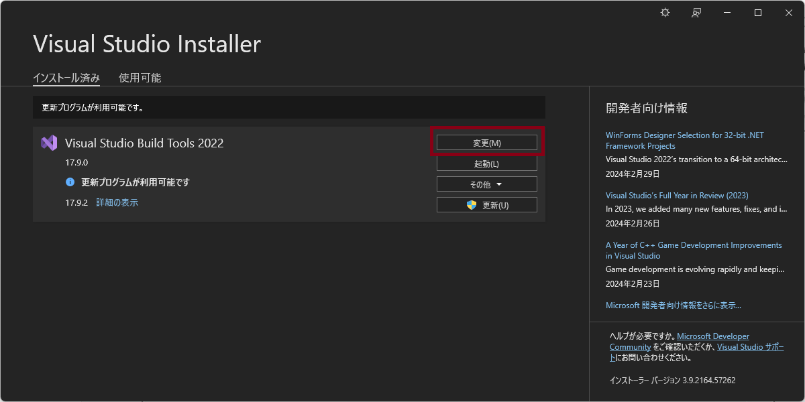
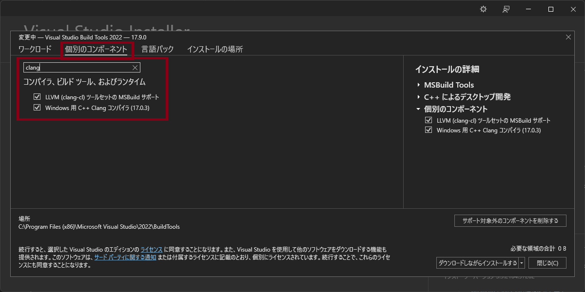

\page windows Windows

[TOC]

There are three choices to make.
- Compiler
- Libraries
- Build system

## Simple Answer
- Use [Clang][Clang] as a compiler
- Use [Visual Studio Build Tools][Visual Studio Build Tools] as libraries
- Use [Ninja][Ninja] as a build system

@note
[WSL](https://learn.microsoft.com/en-us/windows/wsl/about)
(Windows Subsystem for Linux) that allows you to run a Linux environment
on Windows computer is always a good solution for a programmer.
It's also recommended.

### Steps to Build Environment
First, install [Visual Studio Build Tools][Visual Studio Build Tools].

Then open Visual Studio Installer, and add Clang in Visual Studio Build Tools.


Sorry it's in Japanese (I couldn't find language setting).
I think Visual Studio Installer should be installed with Visual Studio Build Tools.
But if not, make it work by yourself and update this document.

Next, install [Ninja][Ninja]

(If you're using VSCode,) add the following to ```.vscode/settings.json```.
Create one if you don't have.
This will make CMake to use Ninja as a generator
(meaning VSCode will add ```-G "Ninja"``` to the command)
```json
"cmake.generator": "Ninja",
"cmake.configureSettings": {
  "CMAKE_MAKE_PROGRAM": "C:/ninja/ninja.exe",
}
```

Now you can build and execute following [Execution page](execution.md).
Make sure you choose ```Clang for MSVC``` as a compiler in the CMake tab
in Visual Studio Code.

## Detailed Explanations for Compiler and Libraries
- [Clang](https://clang.llvm.org/index.html): ***Recommended***
- GCC
- [MSVC](https://en.wikipedia.org/wiki/Microsoft_Visual_C%2B%2B): Currently not eligible with this project
- [VTK](https://vtk.org/): Required for this project, We recommend to install it from the scratch.

### Clang
[Clang](https://clang.llvm.org/index.html)
is easy to install, and recommended in this MPS-Basic project.
There are two ways to install Clang.
- [Official site](https://releases.llvm.org/download.html): ***NOT*** recommended
- [Visual Studio Build Tools](https://visualstudio.microsoft.com/downloads/#build-tools-for-visual-studio-2022): ***Recommended***

Since Clang does not come with libraries, Visual Studio Build Tools is required
even if you install Clang from the official site.
Plus, Clang outside the Visual Studio Build Tools
(meaning installed from the official site)
doesn't seem to work well with libraries in Visual Studio Build Tools.
(Clang didn't recognize OpenMP libraries in Visual Studio Build Tools in my environment.
Maybe there is a way to make it work, but why should we when we have Clang that works fine?)
Therefore we recommend you to use Clang provided in Visual Studio Build Tools.

Visual Studio Build Tools doesn't include Clang by default,
so you have to add it using Visual Studio Installer.

### GCC
GCC (GNU Compiler Collection) is originally built for Linux system,
but there has been some projects
to migrate it into Windows.
[MinGW](https://osdn.net/projects/mingw/) (Minimalist GNU for Windows)
is the most well-known, but it's now outdated.
So if you prefer to use GCC to Clang,
we recommend using [MinGW-w64](https://www.mingw-w64.org/),
which is derived from original MinGW.

MinGW-w64 comes with libraries. You can manage libraries using
[MSYS2](https://www.msys2.org/).

### MSVC
[MSVC](https://en.wikipedia.org/wiki/Microsoft_Visual_C%2B%2B)
(Microsoft Visual C++ Compiler) is a compiler developed and provided by Microsoft
through [Visual Studio Build Tools](https://visualstudio.microsoft.com/downloads/#build-tools-for-visual-studio-2022).
MSVC cannot be used in this MPS-Basic project,
because currently [it only supports OpenMP 2.0](https://learn.microsoft.com/en-us/cpp/build/reference/openmp-enable-openmp-2-0-support?view=msvc-170),
while this project requires OpenMP 5.0.

## Detailed Explanations for Build System
There are mainly three build systems that Windows users can choose.
- [Ninja][Ninja]: ***Recommended***
- Make: ***NOT*** Recommended
- [MSBuild][MSBuild]: ***NOT*** Recommended

### Ninja
[Ninja][Ninja] is easy to install and easy to use.
We recommend beginners to use this build system.

### Make
`Make` can be installed through various ways such as:
- (Original) MinGW (old and not recommended)
- MSYS2
- GnuWin32 (old and not recommended)
- And more...

But most of them are old and not easy to use.
So it's not recommended for beginners.

### MSBuild
[MSBuild][MSBuild] is provided through Visual Studio Build Tools.
It's mainly used in Visual Studio (IDE), but it's independent from Visual Studio,
so you don't have to have Visual Studio to use it.
In that case, you can activate it through command-line.
It's not bad, but there is a problem.
By default, ***it creates an exe file under ```build/Debug``` or ```build/Release```, not under ```build```***.
But the script that we provide assume that the exe file is in ```build``` directory,
so it doesn't work well in this project.

## Detailed Explanations for VTK
[VTK](https://vtk.org/) (Visualization Toolkit) is a library for 3D visualization.
It's required for this project, so you have to install it.
[Official document](https://docs.vtk.org/en/latest/build_instructions/index.html)
is a good reference to install VTK.

[Visual Studio Build Tools]: https://visualstudio.microsoft.com/downloads/#build-tools-for-visual-studio-2022
[Clang]: https://clang.llvm.org/index.html
[Ninja]: https://ninja-build.org/
[MSBuild]: https://learn.microsoft.com/en-us/visualstudio/msbuild/msbuild?view=vs-2022
