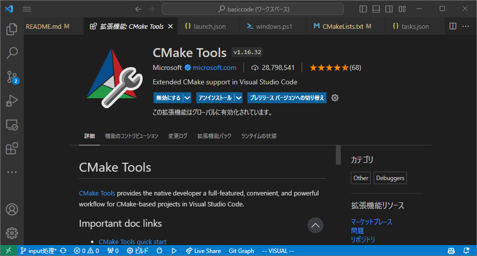

# Execution

[TOC]

## Requirements
### Execution
- Git
- cmake (newer than 3.9)
- C++ 17 compiler
- OpenMP 5.0 and above (optional)

### Development
- Doxygen and Graphviz (optional, for building documents)

### Dependencies
- [argparse](https://github.com/p-ranav/argparse)
- [Eigen](https://eigen.tuxfamily.org/index.php?title=Main_Page)
- [fast-cpp-csv-parser](https://github.com/ben-strasser/fast-cpp-csv-parser)
- [yaml-cpp](https://github.com/jbeder/yaml-cpp)

#### Development
- [GoogleTest (only for testing)](https://github.com/google/googletest)

## Command Line Execution

@note
It's easier to do it in the VS code as shown later,
but it's better to do it in command line for your understanding.

### Build
```bash
cmake -S . -B build # Generate build system
# -S: Source tree. The location of CMakeLists.txt
# -B: Build tree. Directory for storing products for builds
cmake --build build # Execute build
```

- You don't have to make `build` directory (`mkdir build`)
  and move to the directory (`cd build`), thanks to the `-B build` option.
  The `build` directory will be automatically generated if you don't have one.

### Execution
#### Windows
1. Create output directory if not exist
	```powershell
	New-Item -ItemType Directory -Path result/dambreak -Force
	```
2. Remove old output files if exist
	```powershell
	Remove-Item -Path $outputDir/* -Force -Recurse
	```
3. Run simulation
	```powershell
	./build/mps.exe --setting input/dambreak/settings.yml --output result/dambreak 2> result/dambreak/error.log | Tee-Object -FilePath "result/dambreak/console.log"
	```

#### Linux
1. Create output directory if not exist
	```bash
	mkdir -p result/dambreak/
	```
2. Remove old output files if exist
	```bash
	rm -rf result/dambreak/*
	```
3. Run simulation
	```bash
	./build/mps --setting input/dambreak/settings.yml --output result/dambreak 2> result/dambreak/error.log | tee result/dambreak/console.log
	```

#### Note
***(1). Execution Command***

The execution command consists of three parts.
1. Execute with required options
	```powershell
	./build/mps.exe --setting input/dambreak/settings.yml --output result/dambreak
	```
	- ```--setting``` or ```-s``` specifies the setting file.
	- ```--output``` or ```-o``` specifies the output directory.
2. Change standard error output to the specified file.
	```powershell
	2> result/dambreak/error.log
	```
3. Save the console output to the specified file.
	```powershell
	Tee-Object -Filepath "result/dambreak/console.log"
	```

***(2). Standard (Error) Output***

The output of a c++ program includes standard output and standard error output.
The standard output comes from `std::cout` or `printf()`,
while the standard error output comes from `std::cerr` or `fprintf(stderr, )`.
By default, both the standard output and the standard error output will be shown in the console.
Changing the output destination is called "redirect",
and can be accomplished with the `>` command.

For example, the standard output of the command below
will be written to `result.log`.
The standard error output will be shown in the console as usual.
```bash
./test.exe > result.log
```

In the next example, the standard output will be written to `result.log`,
and the standard error output will be written to `error.log`.
```bash
./test.exe 1> result.log 2> error.log
# "1" can be omitted like below.
# ./test.exe > result.log 2> error.log
```

***(2). `tee` command***

`tee` command allows us to show the standard output in the console
and save them into a file at the same time.

> it sends the output of a command in two directions (like the letter T)
>
> <cite>[Microsoft Docs](https://learn.microsoft.com/en-us/powershell/module/microsoft.powershell.utility/tee-object?view=powershell-7.4&viewFallbackFrom=powershell-7.1)</cite>

Foe example, the standard output of the command below will be shown in the console
and will be written to `result.log` at the same time.
```bash
./test.exe | tee result.log
```

#### Scripts
Script files are prepared in the `scripts` folder. You can just call it for execution.

***Windows***
```powershell
./scripts/runner.ps1
```

***Linux/Mac***
```sh
./scripts/runner.sh
```

## VS Code Execution
- Before you begin, install CMake Tools extension.

	

### Build
1. Open Cmake tab.
2. Change `Configure` to `Release`
3. Execute `Build`

	

### Execution
- Execute in the same way as the command line.
- Don't use the `Launch` button on the CMake tab. It will launch the program in a wrong directory, and it won't delete existing files.

#### Note
- You can configure `tasks` to do it easily.

1. Create `.vscode/tasks.json` file.

	

1. An example for Windows:
	```json
	{
		"tasks": [
    	{
      	"label": "Execute",
      	"type": "shell",
      	"command": "./scripts/runner.ps1",
      	"options": {
        	"cwd": "${workspaceFolder}"
      	},
      	"group": {
        	"kind": "test",
        	"isDefault": true
      	}
    	},
  	],
  	"version": "2.0.0"
	}
	```

1. Open Command Palette (`Ctrl + Shift + P` or `F1`). Search and execute `Tasks: Run Test Task`. It does the same thing as calling the script in the terminal.

	

- You can set a keyboard shortcut to run test task.
  To do so, open Command Palette and move on to `Preferences: Keyboard Shortcuts`.
  Search `Tasks: Run Test Task` and set any keybinding you want.
  `Ctrl + Shift + T` is a suggestion of the writer.

	

## Checking Results
Result files will be written in `result/dambreak/vtu/***.vtu`.
Open these files in [ParaView](https://www.paraview.org/) to see the result.

## Debugging
1. Open Cmake tab.
2. Change `Configure` to `Debug`
3. Execute `Debug`

	

- Unlike the `launch` button in the previous section,
  the `debug` button will execute the code in the correct directory.
  Also, there is no need to delete existing files when debugging.
  So you can just press it this time.
